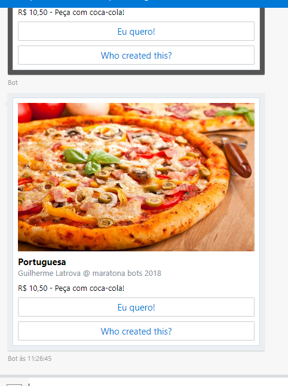

# HeroCards + QnaMaker + Node

Projeto feito no segundo módulo da [maratona BOTS](https://ticapacitacion.com/curso/botspt/) @ 2018, mostrando como usar Node e [QnAMaker](https://qnamaker.ai/) para criar um HeroCard em um chat.

# Resultado

As pizzas foram salvas como `json`, e é retornado um card pra cada pizza cadastrada.



Foi cadastro o seguinte par no QnAMaker:

**Pergunta**
> Quais pizzas você tem?

**Resposta**
> `{"pizzas":[{"pizza":"Marguerita","url":"https://media-cdn.tripadvisor.com/media/photo-s/0f/07/37/12/pizza-marguerita-mussarela.jpg"},{"pizza":"Portuguesa","url":"http://www.receitadodia.com/wp-content/uploads/2015/08/Receita-de-pizza-portuguesa-1.jpg"}]}`

# Referências

- [Repositório com exemplos básicos de QnaMaker com Node](https://github.com/Microsoft/BotBuilder-CognitiveServices/tree/master/Node/samples/QnAMaker)
- [Repositório com exemplos mais completos de QnaMaker com Node](https://github.com/Microsoft/BotBuilder-Samples/tree/master/Node)

## Pacotes usados

- [botbuilder](https://www.npmjs.com/package/botbuilder)
- [botbuilder-cognitive services](https://www.npmjs.com/package/botbuilder-cognitiveservices)

# Setup

```
npm install
node app
```